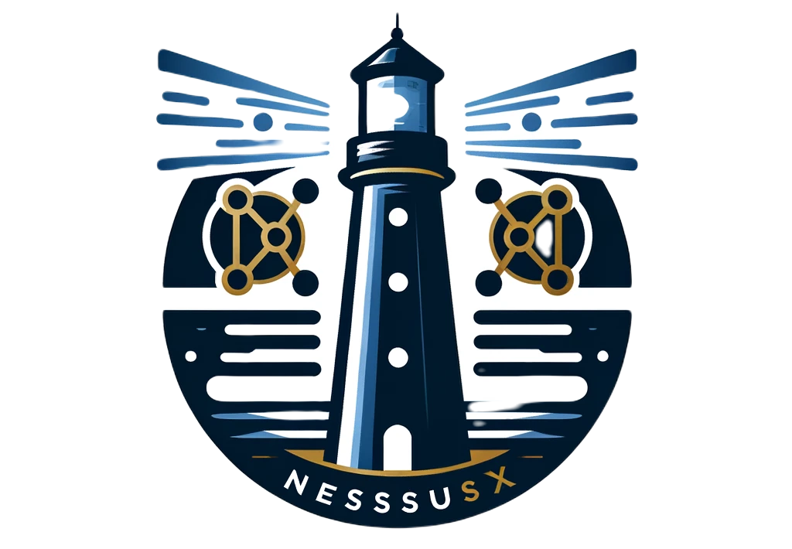

<h1 align="center">
    <br>
    
    <br>
    Nessus X - The definitive parser
</h1>


# nessusx
Fast and reliable rust serialization of xml scan results (.nessus).

## How to use it

```bash
nessusx report.nessus --csv out.csv
[WRN] Use with caution. You are responsible for your actions.
[WRN] Developers assume no liability and are not responsible for any misuse or damage.
```

## ... or use nessusx in your projects

```rust
use nessusx::from_str;

fn main() {

    let file: String = std::fs::read_to_string(xml).unwrap();
    let scan: nessusx::Scan = nessusx::from_str(&file).unwrap();
    let j = serde_json::to_string(&scan).unwrap();
    
    println!("{}", j);
}
````
# Contribute

Contributions are always welcome! Please create a PR to add Github Profile.

## :pencil: License

This project is licensed under [GPL-3.0](https://opensource.org/license/gpl-3-0/) license.

## :man_astronaut: Show your support

Give a ⭐️ if this project helped you!
